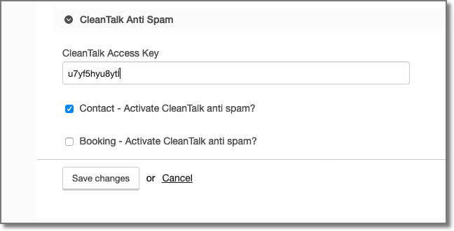

# Perch add-on for the CleanTalk anti-spam service

[CleanTalk](https://cleantalk.org) is an anti-spam service. This Perch add-on uses the CleanTalk API "check_message" method to help prevent spam on Perch Forms.

The impeng_cleantalk add-on is compatible with Perch 3 and Perch Runway 3. 

Cleantalk filtering can be turned on/off on a form by form basis in the Perch settings.

## Pre-requisites
You will need a CleanTalk account (free trial available) which will give you an access key for the API. The current price is $8/year/website. 

## Installation

The add-on is installed in the same way as other Perch add-ons but also requires:

- edits to each Perch page or Runway page template where forms are used to set up PHP session timer.
- every form that uses the add-on needs an additional hidden field (js_on) and also a small Javascript snippet to establish if the client has Javascript enabled.
- every form that uses the add-on must have a regular Perch honeypot field.
- a config file for each form where CleanTalk is used.

### Installation Detail

#### Install app
Copy the impeng_cleantalk folder from inside the download into the folder perch/addons/apps/.

Include the add-on in the Perch apps config file perch/config/apps.php Include impeng_cleantalk after perch_forms.

	```
    $apps_list = [ 
		'perch_forms',
		'impeng_cleantalk',
	];
    ```

#### Editing pages
For each Perch page or Runway page template that has forms on it add the following to the very start before the <!doctype html>
```php
<?php
// start a session
if (!isset($_SESSION)) session_start();

// initialize session variables
$_SESSION['ct_submit_time'] = time();
?>
```

For each Perch page or Runway page template that has forms on it add the following javascript snippet at the bottom somewhere after the closing body tag.
~~~
<script type="text/javascript">
var date = new Date(); document.getElementsByName("js_on")[0].value = date.getFullYear();
</script>
~~~

#### Editing forms

The form needs to be sent to the impeng_cleantalk add-on first. It will then pass the the form onto perch_forms with the honeypot field filled with the cleantalk transaction ID if it is identified as spam (see To Do section below). To do this make sure the the app is "impeng_cleantalk" in the Perch form tag. For example:

~~~
<perch:form id="form-contact" novalidate="novalidate" method="post" app="impeng_cleantalk" role="form" >
~~~


Add a hidden field to every form. It is essential that the field has both an id="js_on" and a name="js_on"
```
 <perch:input type="hidden" id="js_on" name="js_on" value="0">
```

 - Every form has to have a regular Perch honeypot field. Detailed instructions are available on the [Perch site](https://docs.grabaperch.com/addons/blog/spam/). An example is provided below but you will also need to add suitable CSS to disguise the field.

~~~
<perch:label  for="honeypot">Please leave this one alone</perch:label>
<perch:input type="text" id="honeypot" antispam="honeypot" tabindex="-1" autocomplete="off" />
~~~

#### Configuration files
- For each form you will need to produce a configuration file that contains the field IDs of the name, email, message and honeypot fields. (there is a fallback config file that uses the field ids from the example in Perch documentation but this is unlikely to be usefull the honeypot field name is probably incorrect).  The config file should be placed in the folder perch/addons/apps/impeng_cleantalk/config/ with a filename config.[formKey].php (The formKey is the all lowercase version of the name without spaces).An example file would look like the one below but with your forms field names substituted. There is a file called config.example.php which you can edit and rename. 

```
<?php
    // Example config file located at perch/addons/apps/impeng_cleantalk/config/config.formKey.php  - change formKey to your form key
    $honeypotFieldID = 'honeypot';
    $nameFieldID = 'name';
    $emailFieldID = 'email';
    $messageFieldID = 'message';
```
#### Settings

Once installed there will be a new section within the Perch settings for impeng_cleantalk (Perch Admin >> Settings >> General)

Here you will need to add your CleanTalk Access Key. This will be emailed to you when you sign up and is also available from your account on the CleanTalk website.



## Operation
The add-on sends the contents of the form name, email and message fields to CleanTalk together with several other pieces of information (ip address, time to complete form, js enabled, etc). If the form response is identified as spam the response ID from CleanTalk is added to the honeypot field (if empty) so that the form will be added to the spam tab of the forms admin page. The form is then re-dispatched to Perch_forms and will be processed as normal.

## To Do

- Implement the ability to re-dispatch to multiple apps (probably copy Ryan Gittings excellent solution in his [Perch Recaptcha](https://github.com/ryangittings/mbk-forms) Perch add-on.


## Issues
Please raise a Github issue on the menu above.